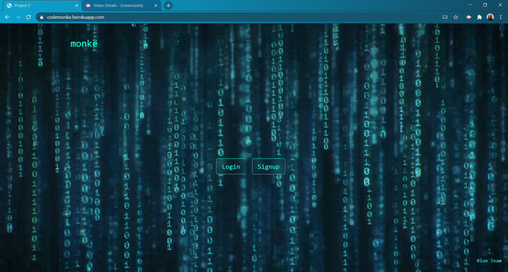

# monke

## Description
React Based Project Used By Clients and Contractors Alike. Clients May Post, Edit and Remove Job Postings From Our Application. Contractors May View, Save and Contact Client Listings. For Future Dev, We Would Like To Setup Functionality Where Contractors Can Create a Profile Making It Easier To Just Autopopulate Their Inormation Into Job Postings and Setting Up Functionality for a Chat Feature Where Contractors and Clients May Contact Each Other Directly.

## Table of Contents

* [Installation](#installation)
* [Usage](#usage)
* [Contribution](#contribution)
* [Tests](#tests)
* [License](#license)
* [Questions](#questions)

## Installation
App Deployed With Heroku: https://codemonke.herokuapp.com/
## Usage
Application Will Hopefully One Day Be Used By Coders to Find Side Jobs or Actual Employment.
## License
MIT
Copyright (c) 2020 
## Contribution
Ky Lucero, Max Daniel, Jordan Kirby, Ben Ivey, Amanda Greaves
## Tests
None
## Questions
For any questions the author can be contacted at:
GitHub: @[kileelucero](https://github.com/),@[maxonemillion](https://github.com/),@[Feizhi255](https://github.com/),@[benjaminivey00](https://github.com/),@[amandagreaves](https://github.com/)
Email: kileelucero@gmail.com
